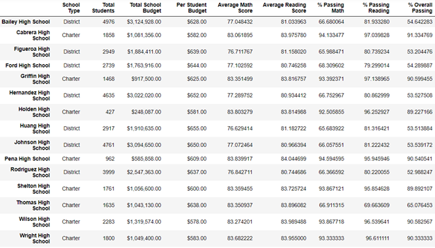
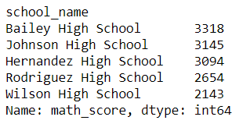
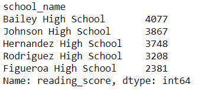
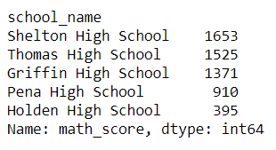
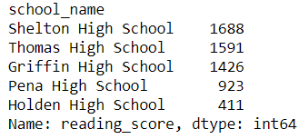
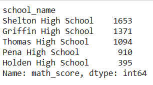
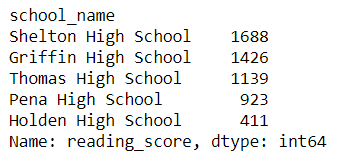

# School_District_Analysis

Analysing student grades using a number of related measures, like school budgets, class sizes, etc.

The main purpose of this challenge is to determine the effect on a number of statistical measures of School District performance of replacing the math and reading scores of the 9th grade students at Thomas High School with *NaN* values.

## District Summary

### DataFrames

The District Summary metrics before the NaN values were added are the following:

And, after the NaN values were added, the District summary was the following:

It would appear that adding NaNs has resulted in a slightly lower values of all three measures of __% Passing Math__, __% Passing Reading__, and __% Overall Passing__.

### Conclusion

This indicates that the average math and reading grades of the 9th grade students at Thomas High School were slightly higher than the district averages.

## School Summary

### DataFrames

The School Summary metrics before the NaN values were added are the following:

And, after the NaN values were added,the School Summary metrics were the following:

### Conclusion

The result of nullifying the math and reading scores of the 9th graders at Thomas High School is that the % Passing Math and % Passing Reading scores for Thomas High School have been severely reduced. 

This indicates that the Math and Reading scores of the 9th grade students at Thomas High School are much higher than the school average. 

No other schools were affected by the change.

## High-Performing Schools

The high-performing schools (top 5) before the nullification of the 9th grade score at Thomas High School are the following:

**Math**

**Reading**

And, after the nullification of the score, the scores are the following:

**Math**

**Reading**

### Conclusion

The math and reading top 5-ranked schools did not change as a result of the nullification of the 9th grade scores at Thomas High School.

## Low-Performing Schools

The low-performing schools (bottom 5) before the nullification of the 9th grade score at Thomas High School are the following:

**Math**

**Reading**

And, after the nullification of the score, the scores are the following:

**Math**

**Reading**

### Conclusion

The math and reading bottom 5-ranked schools did not change as a result of the nullification of the 9th grade scores at Thomas High School. The only difference is that the ranking Thomas High School fell, becoming the 3rd last instead of 4th.

## Math and Reading Scores By Grade

### Math

#### DataFrames

Before the nullification of 9th grade scores at Thomas High School, the math scores by grade were the following:

And, after the nullification, the math scores were the following:

#### Conclusion

The effect of nullifying the 9th grade reading and math scores has on the math scores per grade is that the 9th grade math score for Thomas High School has been nullified as well. No other schools were affected by the change.

### Reading

#### DataFrames

Before the nullification of 9th grade scores at Thomas High School, the reading scores by grade were the following:

And, after the nullification, the reading scores were the following:

#### Conclusion

The effect of nullifying the 9th grade reading and math scores has on the reading scores per grade is that the 9th grade reading score for Thomas High School has been nullified as well. No other schools were affected by the change.

## Scores by School Spending

### DataFrames

Before the nullification of 9th grade scores at Thomas High School, the Scores by School Spending were the following:

And, after the nullification of the 9th grade math and reading scores at Thomas High School, they are the following:

### Conclusion

The % Passing Math, % Passing Reading, and % Overall Passing scores for the $630-644 spending range have all dropped considerably after the nullification of the 9th grade marks at Thomas High School. This indicates that Thomas High School falls in spending range $630 - $644. It can also be concluded that the math and reading scores of the grade 9 students at Thomas High School are considerably higher than the average for schools in their spending range.

## Scores by School Size

### DataFrames

Before the nullification of 9th grade scores at Thomas High School, the Scores by School Size were the following:

And, after the nullification of the 9th grade math and reading scores at Thomas High School, they are the following:

### Conclusion

The % Passing Math, % Passing Reading, and % Overall Passing scores for the medium size range (1000-2000 students) have all dropped considerably after the nullification of the 9th grade marks at Thomas High School. This indicates that Thomas High School falls in Medium school size range. It can also be concluded that the math and reading scores of the grade 9 students at Thomas High School are considerably higher than the average for schools in their school size range.

## Scores by School Type

### DataFrames

Before the nullification of 9th grade scores at Thomas High School, the Scores by School Type were the following:

And, after the nullification of the 9th grade math and reading scores at Thomas High School, they are the following:

### Conclusion

The % Passing Math, % Passing Reading, and % Overall Passing scores for the Charter school type have all dropped considerably after the nullification of the 9th grade marks at Thomas High School. This indicates that Thomas High School is a Charter type school. It can also be concluded that the math and reading scores of the grade 9 students at Thomas High School are considerably higher than the average for schools in their school type.
